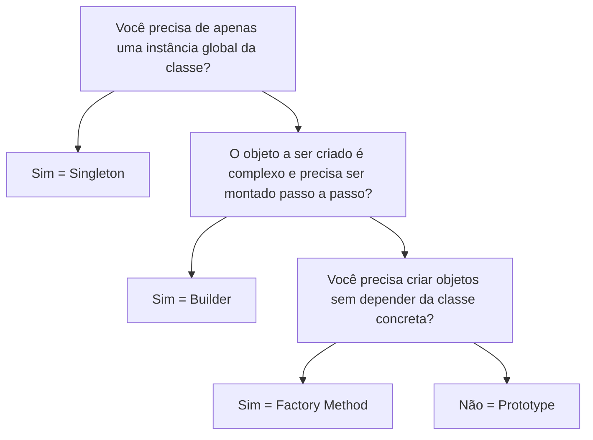

```mermaid
flowchart TD
    B["Você precisa de apenas uma instância global da classe?"]
    B --> M["Sim = Singleton"]
    B --> C["O objeto a ser criado é complexo e precisa ser montado passo a passo?"]
    C --> D["Sim = Builder"]
    C --> E["Você precisa criar objetos sem depender da classe concreta?"]
    E --> F["Sim = Factory Method"]
    E --> G["Não = Prototype"]
```