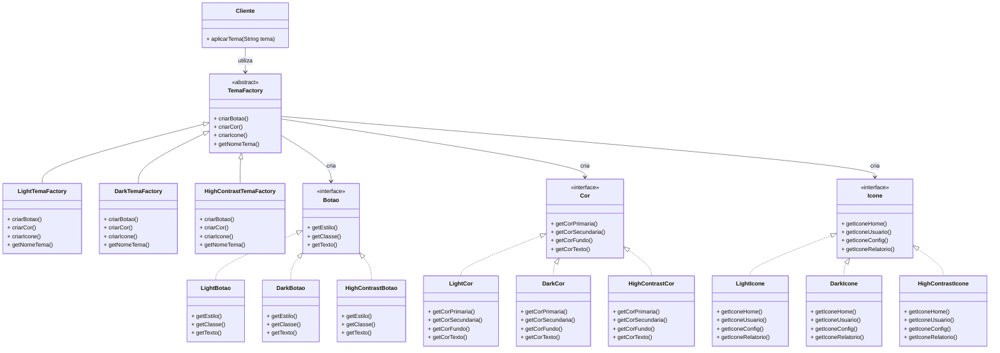

# Abstract Factory Method  

```mermaid
classDiagram
    
    class TemaFactory {
        <<abstract>>
        + criarBotao()
        + criarCor()
        + criarIcone()
        + getNomeTema()
    }

    class LightTemaFactory {
        + criarBotao()
        + criarCor()
        + criarIcone()
        + getNomeTema()
    }

    class DarkTemaFactory {
        + criarBotao()
        + criarCor()
        + criarIcone()
        + getNomeTema()
    }

    class HighContrastTemaFactory {
        + criarBotao()
        + criarCor()
        + criarIcone()
        + getNomeTema()
    }

    TemaFactory <|-- LightTemaFactory
    TemaFactory <|-- DarkTemaFactory
    TemaFactory <|-- HighContrastTemaFactory

    class Botao {
        <<interface>>
        + getEstilo()
        + getClasse()
        + getTexto()
    }

    class Cor {
        <<interface>>
        + getCorPrimaria()
        + getCorSecundaria()
        + getCorFundo()
        + getCorTexto()
    }

    class Icone {
        <<interface>>
        + getIconeHome()
        + getIconeUsuario()
        + getIconeConfig()
        + getIconeRelatorio()
    }

    class LightBotao {
        + getEstilo()
        + getClasse()
        + getTexto()
    }

    class DarkBotao {
        + getEstilo()
        + getClasse()
        + getTexto()
    }

    class HighContrastBotao {
        + getEstilo()
        + getClasse()
        + getTexto()
    }

    Botao <|.. LightBotao
    Botao <|.. DarkBotao
    Botao <|.. HighContrastBotao

    class LightCor {
        + getCorPrimaria()
        + getCorSecundaria()
        + getCorFundo()
        + getCorTexto()
    }

    class DarkCor {
        + getCorPrimaria()
        + getCorSecundaria()
        + getCorFundo()
        + getCorTexto()
    }

    class HighContrastCor {
        + getCorPrimaria()
        + getCorSecundaria()
        + getCorFundo()
        + getCorTexto()
    }

    Cor <|.. LightCor
    Cor <|.. DarkCor
    Cor <|.. HighContrastCor

    class LightIcone {
        + getIconeHome()
        + getIconeUsuario()
        + getIconeConfig()
        + getIconeRelatorio()
    }

    class DarkIcone {
        + getIconeHome()
        + getIconeUsuario()
        + getIconeConfig()
        + getIconeRelatorio()
    }

    class HighContrastIcone {
        + getIconeHome()
        + getIconeUsuario()
        + getIconeConfig()
        + getIconeRelatorio()
    }

    Icone <|.. LightIcone
    Icone <|.. DarkIcone
    Icone <|.. HighContrastIcone

    class Cliente {
        + aplicarTema(String tema)
    }

    Cliente --> TemaFactory : utiliza
    TemaFactory --> Botao : cria
    TemaFactory --> Cor : cria
    TemaFactory --> Icone : cria
```
