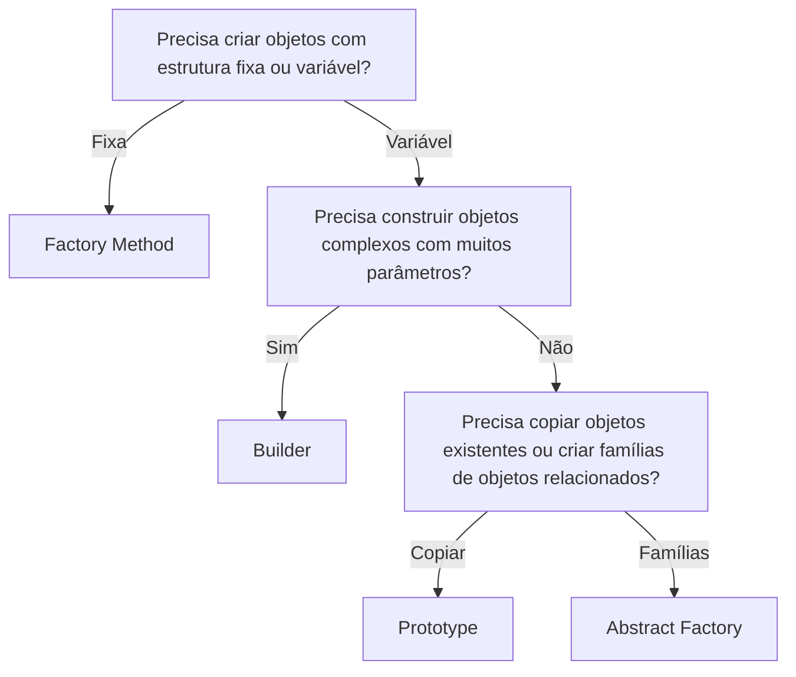

# Fluxograma Binário

```mermaid
graph TD
    A[Precisa criar objetos com estrutura fixa ou variável?] -->|Fixa| B[Factory Method]
    A -->|Variável| C[Precisa construir objetos complexos com muitos parâmetros?]
    C -->|Sim| D[Builder]
    C -->|Não| E[Precisa copiar objetos existentes ou criar famílias de objetos relacionados?]
    E -->|Copiar| F[Prototype]
    E -->|Famílias| G[Abstract Factory]  
```
